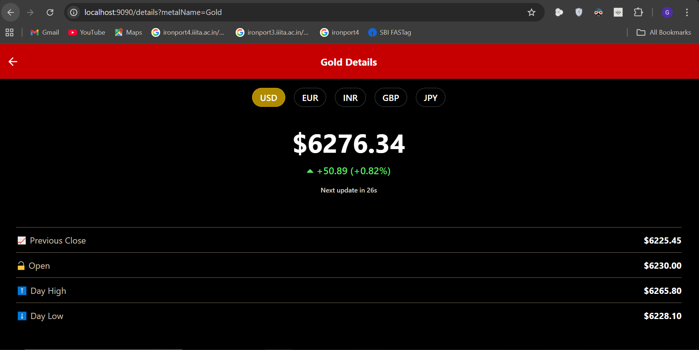
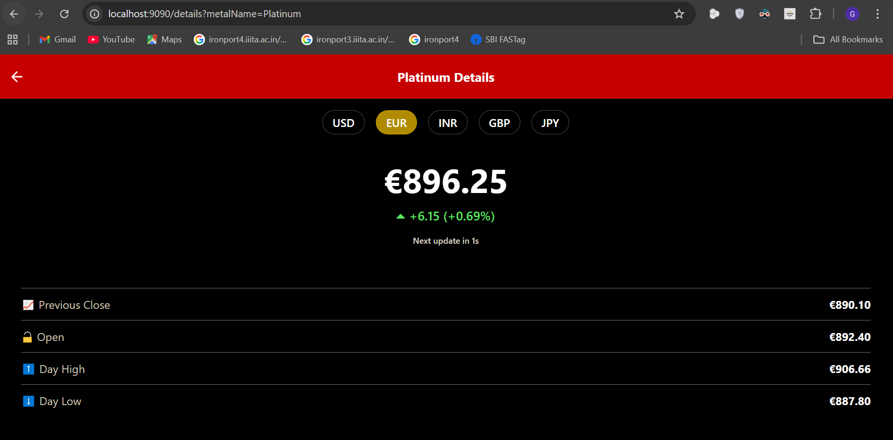

# Live Metal Prices Application

The app displays live prices for **Gold, Silver, Platinum, and Palladium**, updated dynamically every 30 seconds. It features a **Home Screen** with summary tiles and a **Details Screen** with in-depth price information for each metal.

---

## 📸 Screenshots

### 🏠 Home Screen  
Displays a list of metals with their current prices and a synchronized countdown timer for the next update.


### 📊 Details Screen  
Shows detailed information for a selected metal, including price change indicators and a synchronized 30-second update timer.

  


---

## ✨ Features

- **Live Price Tracking** — Fetches and displays prices for Gold, Silver, Platinum, and Palladium.
- **Dynamic Updates** — Prices auto-refresh every 30 seconds across the app.
- **Synchronized Countdown** — Global timer synced across all components for real-time updates.
- **Per-Tile Loaders** — Each tile on the home screen handles its own loading state.
- **Detailed Price View** — Includes:
  - Previous Close, Open, Day High, and Day Low.
  - Change & percentage difference.
  - Visual indicators (▲/▼) for rising/falling prices.
- **Error Handling** — Graceful fallback for individual component failures.

---

## 🛠️ Tech Stack

- **Framework:** React Native (via Expo)
- **Navigation:** Expo Router
- **State Management:** React Hooks (`useState`, `useEffect`, `useContext`)
- **API:** Mock service simulating live market data

---

## 🚀 Getting Started

### Prerequisites

- Node.js (v18+)
- npm or yarn
- Expo Go app on your mobile device

### Setup Instructions

1. **Clone the repository:**
   ```bash
   git clone https://github.com/Mayank-kanojiya/LiveMetalPrice.git
````

2. **Navigate to the project directory:**

   ```bash
   cd LiveMetalPrice
   ```

3. **Install dependencies:**

   ```bash
   npm install
   ```

4. **Install development dependencies:**

   ```bash
   npm install --save-dev cross-env
   ```

5. **Start the application:**

   ```bash
   npm start
   ```

6. **Open the app:**

   * Scan the QR code using the **Expo Go** app (iOS or Android), or
   * Press `a` for Android emulator, `i` for iOS simulator (if available)

---

## 📂 Project Structure (Optional)

<details>
<summary>Click to expand</summary>

```
LiveMetalPrice/
├── assets/
├── components/
│   └── ui/
│       └── MetalTilePrice.tsx
├── constants/
├── contexts/
│   └── TimerContext.tsx
├── tabs/
│   ├── index.tsx
│   ├── details.tsx
│   └── _layout.tsx
├── screenshots/
│   ├── index.PNG
│   ├── gold.PNG
│   ├── platinum.PNG
│   └── ...
└── README.md
```

</details>

---

## 📄 License

This project is licensed under the MIT License.
Feel free to use, modify, or contribute.

```

---

Let me know if you want to include a `.gif` walkthrough, link to a live preview (if hosted), or write a contribution guide as well.
```
